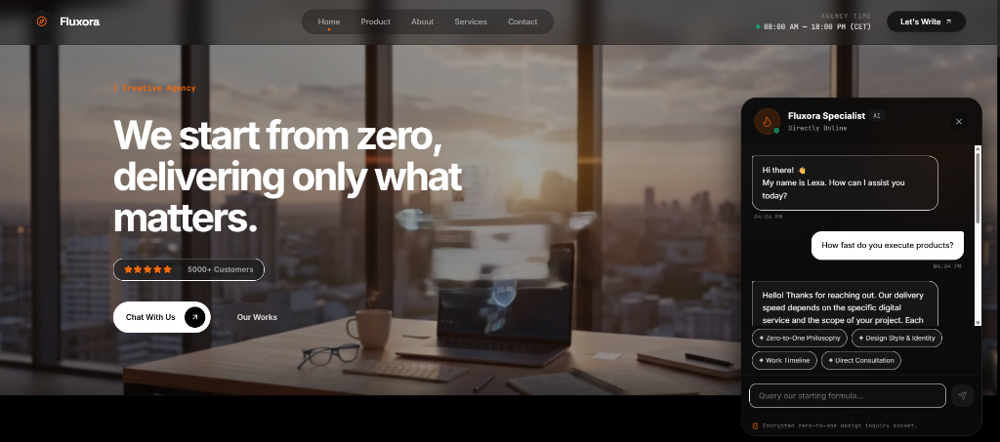

# Fluxora - Premium Creative Agency Landing Page

Fluxora is a high-fidelity, interactive creative agency landing page built with a gorgeous pure black aesthetic, glowing orange accent structures, responsive layouts, and a real-time AI assistant chatbot.

This repository contains the complete frontend codebase (built with React, TypeScript, Vite, and Framer Motion) and is configured to integrate with an **n8n workflow automation backend** for chatbot interaction.

## 📸 Preview



---

## 🌟 Key Features

### 1. Immersive UI & Aesthetics
- **Pure Black Canvas**: Designed with a sleek dark aesthetic (`#000000`) contrasted by neon-orange highlights, glassmorphic elements, and premium typography.
- **Background Video Loop**: Includes a ambient background video overlay representing high-concept creative design.
- **Dynamic Micro-Animations**: Interactive hover effects, spring transitions, and fading animations powered by Framer Motion (`motion/react`).

### 2. Live Copy Editor (Sandbox Suite)
- **Interactive Triggers**: Clicking on the main hero slogan or category tag opens the live sandbox suite (CopySuite).
- **Copy Validation**: Users can customize the copy in real-time. The editor features a character diff checker that validates whether the custom text conforms to the layout density limits of the original Swiss grid structure.
- **Reset Controls**: Easily reset edited text back to the default copy density with one click.

### 3. Interactive Product Showcase
- Displays the agency's primary offerings in a rich media grid:
  - **Website Development**
  - **Digital Menu for Restaurants**
  - **QR Business Cards**
  - **Development Team**
- **Video Previews**: Hovering or viewing the cards shows high-quality auto-playing video mockups for each category.

### 4. About & Premium Services
- **About Grid**: Outlines execution speed, starting from zero philosophy, and consultation scheduling.
- **Interactive Service Pre-selection**: Clicking a service instantly updates the preferred subject line on the contact form.

### 5. High-Conversion Contact Form
- Allows prospective clients to submit inquiries with automatic topic pre-selection to streamline communication.

---

## 🤖 GlassDiscussion AI Chatbot Widget (n8n Powered)

Located in the bottom-right corner, the chatbot widget offers a floating assistant named **Lexa**.

### ⚡ n8n Webhook Integration
The chatbot connects directly to a self-hosted **n8n automation workflow**:
- **Webhook Endpoint**: `http://localhost:5678/webhook/923b864d-0531-4613-921e-dd65ba925ff0/chat`
- **Request Payload**:
  ```json
  {
    "message": "User input text",
    "chatInput": "User input text",
    "sessionId": "sess-[unique-session-id]"
  }
  ```
- **Session Tracking**: Maintains chat history using unique, browser-level `sessionId` tracking.
- **Offline Mode**: If the local n8n backend is offline or CORS headers are misconfigured, the chat widget automatically displays a troubleshooting notice.

### 🕒 Dynamic Status Indicator
- The widget has an online/offline status dot that changes based on local Paris time (CET/CEST):
  - **Online**: 8:00 AM - 6:00 PM CET (Directly Online).
  - **Offline**: Outside business hours (Away • Auto Concierge mode).

---

## 📂 Project Structure

```bash
Fluxora/
├── src/
│   ├── assets/             # Project static assets & images
│   ├── components/         # React Components
│   │   ├── Header.tsx            # Navigation header
│   │   ├── SilhouetteHero.tsx    # Left & center hero elements
│   │   ├── ProductSection.tsx    # Showcase gallery with videos
│   │   ├── AboutSection.tsx      # Core agency values & philosophy
│   │   ├── ServicesSection.tsx   # Customizable service cards
│   │   ├── ContactSection.tsx    # Consultation form
│   │   ├── CopySuite.tsx         # Sandbox editor sidebar
│   │   ├── GlassDiscussion.tsx   # AI chatbot widget with n8n hooks
│   │   └── Footer.tsx            # Dynamic footer with site links
│   ├── App.tsx             # Main application component & layout state
│   ├── data.ts             # Service details, menu structures, and copy definitions
│   ├── main.tsx            # Vite client-side entrypoint
│   ├── types.ts            # Type definitions
│   └── index.css           # Global CSS and custom styles
├── index.html              # HTML template
├── package.json            # npm dependencies and scripts
└── tsconfig.json           # TypeScript configuration
```

---

## 🚀 Running Locally

### 1. Install Dependencies
```bash
npm install
```

### 2. Set Up the n8n Chatbot Backend (Optional)
1. Ensure you have **n8n** installed and running on your machine:
   ```bash
   npx n8n start
   ```
2. Import or configure a webhook trigger node pointing to the local chat workflow:
   `http://localhost:5678/webhook/923b864d-0531-4613-921e-dd65ba925ff0/chat`
3. Ensure the workflow permits incoming CORS requests or returns JSON responses in the format `{ "output": "Bot's response text" }`.

### 3. Run the Development Server
```bash
npm run dev
```
Open your browser and navigate to [http://localhost:5173](http://localhost:5173).

---

## 🛠️ Tech Stack & Technologies
- **Core**: React 18, Vite, TypeScript
- **Styling**: Vanilla CSS, Tailwind CSS utilities
- **Animations**: Framer Motion (`motion/react`)
- **Icons**: Lucide React
- **Integration**: n8n Workflow Automation API
